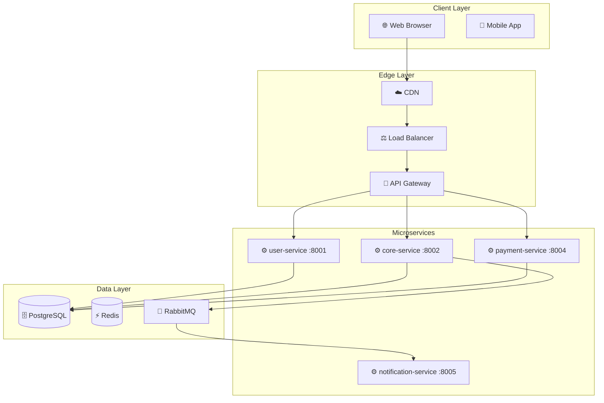

# 🏗️ AI Software Architecture Designer

> Converts natural language project descriptions into complete software architectures with Mermaid diagrams, microservice layouts, database schemas, and deployment strategies.

[](https://github.com/PranayMahendrakar/ai-software-architecture-designer/actions)
[](https://pranaymahendrakar.github.io/ai-software-architecture-designer/)
[](https://python.org)
[](LICENSE)

---

## 🚀 Live Demo

👉 **[View Interactive Diagrams on GitHub Pages](https://pranaymahendrakar.github.io/ai-software-architecture-designer/)**

---

## ✨ Features

- **Natural Language Input** → Describe your project in plain English
- **4 Auto-Generated Outputs:**
  1. 🏗️ System Architecture Diagram (Mermaid flowchart)
  2. 🔀 Microservice Layout (service interactions)
  3. 🗄️ Database Schema (ER diagram with tables, columns, relationships)
  4. 🚀 Deployment Strategy (Kubernetes or Docker Compose)
- **GitHub Actions CI/CD** — Regenerates examples on every push
- **GitHub Pages** — Interactive Mermaid diagram viewer
- **4 Built-in Examples:** E-Commerce, Real-Time Chat, IoT Platform, SaaS App

---

## 🔧 Architecture Pipeline

```
Natural Language Description
         │
         ▼
 ┌─────────────────────┐
 │  requirement_parser │  ← Extracts features, entities, scale, integrations
 └─────────────────────┘
         │
         ▼
 ┌──────────────────────────┐
 │  architecture_planner    │  ← Selects pattern, services, databases, broker
 └──────────────────────────┘
         │
         ▼
 ┌──────────────────────────┐
 │  component_generator     │  ← DB tables, endpoints, Docker/K8s snippets
 └──────────────────────────┘
         │
         ▼
 ┌──────────────────────────┐
 │  diagram_builder         │  ← 4 Mermaid diagrams
 └──────────────────────────┘
         │
         ▼
 Full Architecture + Diagrams
```

---

## 📦 Modules

| Module | Description |
|--------|-------------|
| `requirement_parser.py` | Parses NL descriptions. Detects features, entities, scale (small/medium/large), auth, realtime needs, storage types |
| `architecture_planner.py` | Plans architecture pattern (monolith/microservices/event-driven), services, databases, message broker, deployment |
| `component_generator.py` | Generates DB tables with full column specs, service endpoints, env vars, Dockerfile, Docker Compose & K8s snippets |
| `diagram_builder.py` | Builds 4 Mermaid diagrams: system architecture, microservice layout, ER schema, deployment strategy |

---

## ⚡ Quick Start

```bash
# Clone the repository
git clone https://github.com/PranayMahendrakar/ai-software-architecture-designer.git
cd ai-software-architecture-designer

# Run with a built-in example (no deps required!)
python main.py --example ecommerce

# Run with your own description
python main.py --description "Build a food delivery app like DoorDash with real-time driver tracking and Stripe payments"

# Interactive mode
python main.py --interactive

# List all options
python main.py --help
```

---

## 📋 Built-in Examples

| Example | Description | Scale | Pattern |
|---------|-------------|-------|---------|
| `ecommerce` | E-commerce with products, cart, Stripe payments, real-time tracking | Medium | Microservices |
| `chat` | Real-time chat with rooms, OAuth, file sharing, search | Medium | Microservices |
| `iot` | IoT platform: sensor ingestion, time-series, alerts, dashboards | Large | Event-Driven |
| `saas` | SaaS PM tool with teams, SSO, Slack, webhooks, multi-tenancy | Large | Microservices |

---

## 📊 Sample Output (E-Commerce)

### System Architecture


### Database Schema (excerpt)
```mermaid
erDiagram
    USERS { UUID id PK, VARCHAR email UK, VARCHAR password_hash }
    ORDERS { UUID id PK, UUID user_id FK, VARCHAR status, DECIMAL total }
    PRODUCTS { UUID id PK, VARCHAR name, DECIMAL price, INTEGER stock }
    USERS ||--o{ ORDERS : "places"
    ORDERS }o--|| PRODUCTS : "contains"
```

---

## 🤖 GitHub Actions Automation

The workflow `.github/workflows/generate-architecture.yml` automatically:

1. **Triggers** on every push to `main` that changes modules or `main.py`
2. **Runs** all 4 built-in examples in a matrix strategy (parallel)
3. **Uploads** architecture artifacts (JSON reports + `.mmd` files)
4. **Rebuilds** the GitHub Pages site with updated diagrams
5. **Deploys** to GitHub Pages

Supports **manual trigger** (`workflow_dispatch`) with custom description input.

---

## 📁 Project Structure

```
ai-software-architecture-designer/
├── main.py                          # CLI entry point
├── requirements.txt                 # Dependencies
├── modules/
│   ├── __init__.py                  # Package exports
│   ├── requirement_parser.py        # NL → structured requirements
│   ├── architecture_planner.py      # Requirements → architecture plan
│   ├── component_generator.py       # Plan → detailed components + DB schema
│   └── diagram_builder.py           # Components → 4 Mermaid diagrams
├── docs/
│   └── index.html                   # GitHub Pages interactive viewer
├── .github/
│   └── workflows/
│       └── generate-architecture.yml  # CI/CD automation
└── output/                          # Generated architecture files (gitignored)
    ├── ecommerce/
    │   ├── diagrams/
    │   │   ├── *.mmd                # Mermaid diagram files
    │   ├── *-architecture.json      # Full JSON report
    │   └── *-summary.md             # Markdown summary
```

---

## 🌐 GitHub Pages

The interactive viewer at `docs/index.html` provides:

- **Tabbed navigation** between Architecture Examples, Mermaid Diagrams, Modules, and Try Generator
- **Live Mermaid rendering** via CDN (dark theme)
- **4 diagram types** with tab switching: System Architecture, Microservice Layout, DB Schema, Deployment
- **Interactive analyzer** — paste a description to get instant architecture insights
- **Code examples** for running locally

---

## 📄 License

MIT License — see [LICENSE](LICENSE) for details.

---

*Built with ❤️ using Python 3.12 and Mermaid.js — auto-deployed via GitHub Actions*
