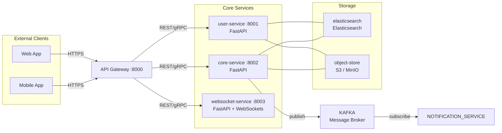

# time chat - Architecture Summary

> Create a real-time chat application where users can join rooms, send messages, and share files. Support OAuth login with Google. Messages should persist and be searchable. Scale for thousands of users.

## Pattern
**event-driven microservices**

## Services (5)
- **api-gateway** :8000 — Route requests, rate limiting, auth verification
- **user-service** :8001 — User registration, login, profile management
- **core-service** :8002 — Main business logic for time chat
- **websocket-service** :8003 — Real-time event broadcasting and WebSocket management
- **frontend** :3000 — User interface and client-side rendering

## Databases
- **elasticsearch** (Elasticsearch) — Used by: search-service
- **object-store** (S3 / MinIO) — Used by: file uploads

## Diagrams

### System Architecture
```mermaid
graph TB
    subgraph Client["Client Layer"]
        Browser["🌐 Web Browser"]
        Mobile["📱 Mobile App"]
    end

    subgraph Edge["Edge Layer"]
        CDN["☁️ CDN / CloudFront"]
        LB["⚖️ Load Balancer"]
        GW["🔀 API Gateway"]
    end

    subgraph Services["Microservices"]
        USER_SERVICE["⚙️ user-service"]
        CORE_SERVICE["⚙️ core-service"]
        WEBSOCKET_SERVICE["⚙️ websocket-service"]
    end

    subgraph Data["Data Layer"]
        ELASTICSEARCH[""📦 elasticsearch (Elasticsearch)"]
        OBJECT_STORE[""📦 object-store (S3 / MinIO)"]
        BROKER["📨 Kafka Message Broker"]
    end

    Browser --> CDN
    Mobile --> CDN
    CDN --> LB
    LB --> GW
    GW --> USER_SERVICE
    GW --> CORE_SERVICE
    GW --> WEBSOCKET_SERVICE
    USER_SERVICE --> ELASTICSEARCH
    USER_SERVICE --> OBJECT_STORE
    CORE_SERVICE --> ELASTICSEARCH
    CORE_SERVICE --> OBJECT_STORE
    WEBSOCKET_SERVICE --> ELASTICSEARCH
    WEBSOCKET_SERVICE --> OBJECT_STORE
    CORE_SERVICE --> BROKER
    BROKER --> NOTIFICATION_SERVICE

    style Client fill:#1a1a2e,stroke:#e94560
    style Edge fill:#16213e,stroke:#0f3460
    style Services fill:#0f3460,stroke:#533483
    style Data fill:#533483,stroke:#e94560
```

### Microservice Layout


### Database Schema
```mermaid
erDiagram
    USERS {
        UUID id PK
        VARCHAR(255) email
        VARCHAR(255) password_hash
        VARCHAR(100) full_name
        VARCHAR(50) role
        BOOLEAN is_active
        TIMESTAMP created_at
        TIMESTAMP updated_at
    }

    SESSIONS {
        UUID id PK
        UUID user_id FK
        VARCHAR(512) token_hash
        TIMESTAMP expires_at
        INET ip_address
        TIMESTAMP created_at
    }

    AUDIT_LOGS {
        BIGSERIAL id PK
        VARCHAR(100) entity_type
        UUID entity_id
        VARCHAR(50) action
        UUID actor_id FK
        JSONB metadata
        TIMESTAMP created_at
    }

    PRODUCTS {
        UUID id PK
        VARCHAR(255) name
        TEXT description
        DECIMAL(10,2) price
        INTEGER stock_quantity
        UUID category_id FK
        BOOLEAN is_active
        TIMESTAMP created_at
    }

    ORDERS {
        UUID id PK
        UUID user_id FK
        VARCHAR(50) status
        DECIMAL(10,2) total_amount
        VARCHAR(255) payment_intent_id
        JSONB shipping_address
        TIMESTAMP created_at
        TIMESTAMP updated_at
    }

    SESSIONS }o--||  USERS : "belongs to"
    ORDERS }o--||  USERS : "belongs to"
    AUDIT_LOGS }o--||  USERS : "belongs to"
```

### Deployment Strategy

```mermaid
graph TB
    subgraph Cloud[Cloud Provider - AWS / GCP / Azure]
        subgraph VPC[Virtual Private Cloud]
            subgraph PublicSubnet[Public Subnet]
                IGW[Internet Gateway]
                ALB[Application Load Balancer]
            end

            subgraph K8S[Kubernetes Cluster]
                subgraph ControlPlane[Control Plane]
                    API[API Server]
                    SCHED[Scheduler]
                    ETCD[etcd]
                end

                subgraph NodeGroup1[Node Group - App]
                    POD1[api-gateway Pod x2]
                    POD2[user-service Pod x3]
                    POD3[core-service Pod x3]
                end

                subgraph NodeGroup2[Node Group - Workers]
                    POD4[payment-service Pod x2]
                    POD5[notification-service Pod x2]
                    POD6[websocket-service Pod x2]
                end

                subgraph Ingress[Ingress / Service Mesh]
                    ING[Nginx Ingress]
                    ISTIO[Istio Sidecar]
                end
            end

            subgraph DataSubnet[Private Data Subnet]
                RDS[RDS PostgreSQL Multi-AZ]
                REDIS[ElastiCache Redis Cluster]
                MSK[MSK - Managed Kafka]
            end
        end

        S3[S3 Object Storage]
        CF[CloudFront CDN]
        CW[CloudWatch Monitoring]
        SM[Secrets Manager]
    end

    Internet((Internet)) --> CF
    CF --> ALB
    ALB --> ING
    ING --> POD1
    POD1 --> POD2
    POD1 --> POD3
    POD3 --> RDS
    POD3 --> REDIS
    POD3 --> MSK
    POD2 --> RDS
    MSK --> POD5

    style Cloud fill:#232f3e,stroke:#ff9900
    style K8S fill:#326ce5,stroke:#fff,color:#fff
    style DataSubnet fill:#1a1a2e,stroke:#e94560
```

